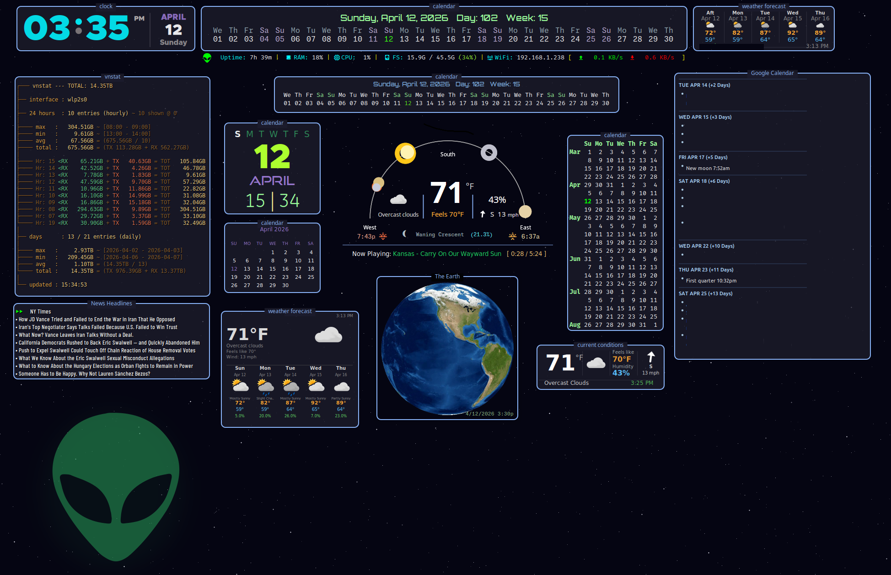

# Alien Conky Suite

A modular, feature-rich collection of **17 Conky scripts** across 9 categories, designed to create a cohesive and interactive desktop experience.
Run everything together or each component independently.

* All components are **fully modular**
* Designed for **low clutter, high signal**
* Easily customizable and extendable
* Conky scripts built on Linux Mint 22.3/Cinnamon Edition

---




## Overview

| Category | Scripts |
|---|---|
| **Clock** | Animated Clock, Now Playing (Song Info) |
| **Weather** | Current Conditions, Forecast, Full Panel |
| **Calendar** | Horizontal Calendar (Lua), Horizontal Calendar (Bash), khal calendar, allcombined Lua Calendar, Side Panel calendar |
| **System** | Single-line System Monitor |
| **Network** | vnStat Bandwidth Monitor |
| **Arc** | Enhanced Arc (weather + moon phase) |
| **Google Calendar** | Month-view (gcalcli + Lua) |
| **RSS** | Click-enabled Feed Viewer |
| **Stocks** | Current stock prices |

The **Earth Viewer** component is adapted from the *Aurora* set.

---

## Getting Started

Run the setup script:

```bash
./configure-alien.sh
```

This will:

* Create a `.env` file
* Store your:

  * API key
  * Latitude / Longitude
  * Unit preferences
* Automatically detect your active network interface
* Configure required scripts

---

## Features

### Interactive RSS Feed

* Clickable articles using `xdotool`
* Toggle feeds via the double-arrow control
* Fully customizable via:

  ```
  RSS/feeds.conf
  ```

### Animated Clock Enhancements

* Seconds are visualized within the minute divider

### Weather System

* Uses **National Weather Service (NWS)** data for forecast and **openweathrmap.org (OWM) api** for current conditions.
  * Note - OWM requires an api key. You can obtain one free at https://openweathermap.org/

* Separate scripts for:

  * Current conditions
  * Forecast

## Stock Price table display for current stock prices

* Requires an API key from FinnHub for stock data. You can obtain one free at https://www.finnhub.io/
* Customize stock symbols at stocks/symbols.conf

### Arc Widget Enhancements

* Includes current forecast and moon phase rendering
* Expanded from original github/@gtex62 design

### Modular Design

* Every widget runs independently:

  ```bash
  conky -c script.rc
  ```

### tmux Integration

* Launch all widgets at once:

  ```bash
  ./alien-tmux
  ```
* Stop everything:

  ```bash
  tmux kill-session -t conky
  ```

#### alien-tmux2 — Selective Launch

`alien-tmux2` lets you launch any subset of widgets by passing short codes as arguments.
Up to 4 conky processes are grouped per tmux window; the layout is tiled automatically.

**Usage:**

```bash
# Launch specific widgets by code
./alien-tmux2 t a wc wf

# Or pass a bracketed, comma-separated list
./alien-tmux2 [t,a,wc,wf]
```

**Widget Codes:**

| Code | RC File | Widget |
|---|---|---|
| `a` | `arc/arc.rc` | Arc (horizon, planets, sun/moon, weather) |
| `e` | `earth/earth.rc` | Earth satellite image viewer |
| `g` | `gcal/gcal.rc` | Google Calendar month-view |
| `h2` | `calendar/hcal2.rc` | Horizontal Lua calendar (full-width) |
| `hc` | `calendar/hcal.rc` | Horizontal calendar (compact, bash) |
| `kc` | `calendar/kcalendar.rc` | khal-based calendar panel |
| `lc` | `calendar/lcalendar.rc` | Lua-drawn allcombined calendar |
| `m` | `clock/song-info.rc` | Now Playing (song info) |
| `r` | `rss/rss2.rc` | RSS feed viewer |
| `$` | `stocks/ticker.rc` | Stock price table |
| `s` | `calendar/sys-small.rc` | Single-line system monitor |
| `sc` | `calendar/sidepanel-calendar.rc` | Side panel calendar |
| `t` | `clock/clock.rc` | Animated clock |
| `v` | `vnstat/vnstat.rc` | vnStat bandwidth monitor |
| `wa` | `weather/full.rc` | Full weather panel |
| `wc` | `weather/current.rc` | Current conditions |
| `wf` | `weather/forecast.rc` | 5-day forecast strip |

---

## File Tree

```
.
├── alien-tmux                  - launch all widgets via tmux
├── alien-tmux2                 - alternate tmux launch config. Uses 1 or 2 letter codes to launch specified conkys in tmux.
├── configure-alien.sh          - interactive setup (API key, lat/lon, interface)
├── theme.lua                   - global colors (borders, backgrounds)
├── .env-example                - environment variable template
│
├── arc/
│   ├── arc.rc                  - horizon arc, planets, sun/moon, sunrise/sunset, current weather
│   ├── arc3.lua
│   ├── settings.lua
│   └── sky_update.py
│
├── calendar/
│   ├── hcal2.rc                - full-width horizontal Lua calendar via hcal2.lua (primary)
│   ├── hcal.rc                 - compact horizontal calendar via hcal.sh
│   ├── kcalendar.rc            - khal-based calendar panel via khal-calendar.sh 
│   ├── lcalendar.rc            - Lua-drawn calendar from allcombined2.lua
│   ├── sidepanel-calendar.rc   - large date/day/month side panel (conky vars)
│   ├── sys-small.rc            - single-line system monitor (CPU / RAM / FS / WiFi)
│   ├── fmt.lua
│   ├── hcal2.lua
│   ├── hcal.sh
│   ├── khal-calendar.sh
│   ├── loadall.lua
│   └── settings.lua
│
├── clock/
│   ├── clock.rc                - animated clock widget (0.5 s updates)
│   ├── song-info.rc            - single-line Now Playing via playerctl
│   ├── clock.lua
│   ├── loadall.lua
│   └── settings.lua
│
├── earth/
│   ├── earth.rc                - live Earth satellite image viewer
│   ├── loadall.lua
│   └── settings.lua
│
├── fonts
│   ├── BarlowCondensed-Regular.ttf
│   ├── Good Times Rg.otf
│   ├── Metropolis Black.ttf
│   ├── Orbitron
│   └── Oxanium
│
├── gcal/
│   ├── gcal.rc                 - Google Calendar month-view via gcalcli (Lua rendered)
│   ├── gcal2.lua
│   ├── loadall.lua
│   └── settings.lua
│
├── rss/
│   ├── rss.rc                  - click-enabled RSS feed viewer
│   ├── feeds.conf
│   ├── loadall.lua
│   ├── rss-click.sh
│   ├── rss-daemon.sh
│   ├── rss-fetch.sh
│   ├── rss-next.sh
│   └── settings.lua
│
├── scripts/
│   ├── owm_fetch.sh            - shared OWM API fetch & icon cache script
│   ├── allcombined2.lua
│   ├── background.lua
│   ├── json.lua
│   ├── loadall.lua
│   └── lua3-bars.lua
│
├── stocks
│   ├── loadall.lua
│   ├── settings.lua
│   ├── stocks.lua
│   ├── symbols.conf
│   └── ticker.rc               - stock ticker, Place stock symbols in symbols.conf
│
├── utils0
│   ├── rc
│   └── save-pos.sh
│
├── vnstat/
│   ├── vnstat.rc               - vnstat network bandwidth history (daily / monthly)
│   ├── vnstat.lua
│   ├── loadall.lua
│   └── settings.lua
│
└── weather/
    ├── current.rc              - standalone current conditions widget via alien-weather-current.lua
    ├── forecast.rc             - compact 5-day forecast strip va alien-weather-forecast.lua
    ├── full.rc                 - full weather panel va alien-weather-full.lua
    ├── alien-weather-current.lua
    ├── alien-weather-forecast.lua
    ├── alien-weather-full.lua
    ├── loadall.lua
    ├── nws_weather.lua
    ├── owm-current.sh
    ├── owm-fetch.lua
    └── settings.lua
```


## Utilities

* **`save-pos.sh`** — Calculates the current position of all running conkys. Using alt+mouse drag, relocate conkys to your desired position and in a separate terminal window run `save-pos.sh`. The script can also be run on individual windows using the keys below.

  > **Note:** Each conky redraws at its next update interval. Widgets with long intervals
  > (such as calendar scripts) should be restarted after repositioning to reflect the change immediately.

  **Window Reference** — keys used to target individual windows:

  | Key | Window Title | RC File |
  |---|---|---|
  | `rss` | `rss` | `rss/rss.rc` |
  | `sys-small` | `sys-small` | `calendar/sys-small.rc` |
  | `current` | `w-current` | `weather/current.rc` |
  | `forecast` | `w-forecast` | `weather/forecast.rc` |
  | `full` | `w-full` | `weather/full.rc` |
  | `song-info` | `song-info` | `clock/song-info.rc` |
  | `clock` | `conky_clock` | `clock/clock.rc` |
  | `vnstat` | `vnstat` | `vnstat/vnstat.rc` |
  | `hcal2` | `hcal2` | `calendar/hcal2.rc` |
  | `hcal` | `hcal` | `calendar/hcal.rc` |
  | `arc` | `conky-arc` | `arc/arc.rc` |
  | `sp-cal` | `sp-cal` | `calendar/sidepanel-calendar.rc` |
  | `khal-cal` | `khal-cal` | `calendar/kcalendar.rc` |
  | `ac-cal` | `ac-cal` | `calendar/lcalendar.rc` |
  | `earth` | `earth` | `earth/earth.rc` |
  | `gcal` | `gcal` | `gcal/gcal.rc` |
  | `stocks` | `stocks` | `stocks/ticker.rc` |

* **`rc`** — Place in your `~/bin` or any directory on `PATH`. Run any conky script with `rc conky`, saving keystrokes. Useful for launching individual conkys quickly.

---

## Theming

Global appearance is controlled via:

```bash
theme.lua
```

This file defines:

* Border colors
* Background colors
* Theme font

---

## Dependencies

### Required

* `conky` (with Lua + Cairo support)
* `jq`
* `curl`
* `xdotool`
* `tmux`
* `vnstat`
* `python3`

### Calendar & Agenda

* `khal` — local calendar store; used by `kcalendar.rc`
* `gcalcli` — Google Calendar CLI; used by `gcal.rc`

### Media

* `playerctl` — MPRIS media player control; used by `song-info.rc`

### Fonts

Bundled (in `fonts/`):

* **Orbitron**
* **Oxanium**
* **Barlow Condensed** — `rss.rc`
* **Metropolis** — `clock.rc`, `sidepanel-calendar.rc`
* **Good Times** — `sidepanel-calendar.rc`, `hcal2.rc`

Additional fonts required (install separately):

* **MonaspiceNe Nerd Font** — primary monospace, `earth.rc`
* **FiraCode Nerd Font** — `sys-small.rc`, `song-info.rc`
* **SpaceMono Nerd Font** — `sys-small.rc`, `song-info.rc`

Nerd Fonts: <https://www.nerdfonts.com/>

### Optional

* `lua-cjson` *(fallback included in `scripts/json.lua`)*
* `librsvg2-bin` *(only needed if weather icons are returned as SVG and you want PNG conversion)*

---

## Credits

* **github/@gtex62** — Original author of gtex62-clean-suite - weather widget formed the foundation of the enhanced Arc implementation
* **github/@wim66** — Original author of background.lua, lua3-bars.lua
* **allcombined2.lua** - Original Lua scripting: Mr Peachy, Modified/Maintained by: github/@Fehlix (MX Linux Team),  MX Linux Conky Collection
* **Aurora Set** — Source of the Earth Viewer component github @rew62/aurora

---
