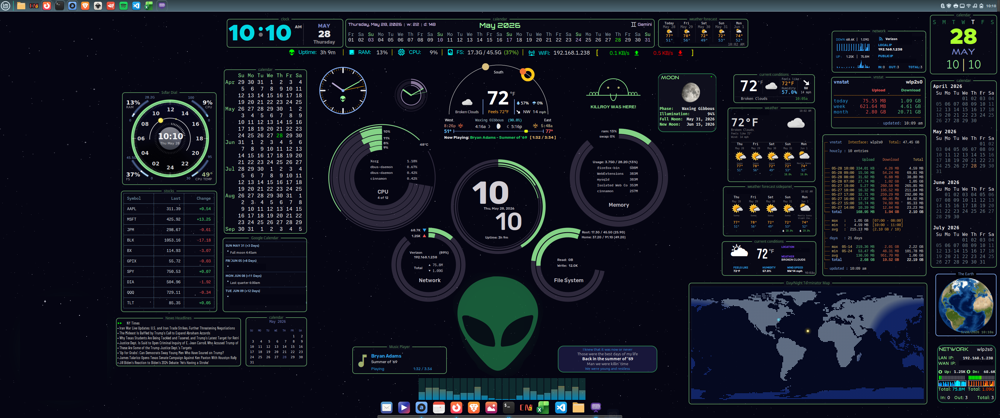

# Alien Conky Suite

A modular, feature-rich collection of **30 Conky scripts** across **12 categories**, designed to create a cohesive and interactive desktop experience.
Run everything together or each component independently.

* All components are **fully modular**
* Designed for **low clutter, high signal**
* Easily customizable and extendable
* Conky scripts built on Linux Mint 22.3/Cinnamon Edition

---




## Overview

| Category | Scripts |
|---|---|
| **Analog Clock** | Analog Clock, Analog Clock Rings |
| **Clock** | Animated Clock, Now Playing (Song Info), Now Playing Sidepanel |
| **Weather** | Current Conditions (top + sidepanel), Forecast (small + sidepanel), Full Panel |
| **Calendar** | Horizontal Calendar (Lua), Horizontal Calendar (Bash), Multi-Month Calendar, khal calendar, allcombined Lua Calendar, Side Panel calendar |
| **System** | Single-line System Monitor |
| **Network** | vnStat Bandwidth Monitor, Network Traffic Panel |
| **Arc** | Enhanced Arc (weather + moon phase) |
| **Google Calendar** | Month-view (gcalcli + Lua) |
| **RSS** | Click-enabled Feed Viewer |
| **Stocks** | Current stock prices |
| **Terminator** | Day/night terminator map |
| **Solar Dial** | Solar Dial, Solar Dial Ring |

The **Earth Viewer** component is adapted from the *Aurora* set.

---

## Getting Started


Install conky and dependencies:

````bash
sudo apt install conky-all tmux curl xdotool vnstat jq python3-ephem playerctl librsvg2-bin luarocks gcalcli khal git fonts-ibm-plex
````

Install Alien:
````bash
cd ~/.conky
git clone https://github.com/rew62/alien.git
cd alien
````

Run the setup script:

```bash
./configure-alien.sh    # interactive setup only
./configure-alien2.sh   # setup + automated font install from fonts/
```

This will:

* Create or update `.env` with:

  * `OWM_API_KEY` — OpenWeatherMap API key
  * `FINNHUB_API_KEY` — FinnHub API key (stocks widget)
  * `CITY_ID` — OWM city ID
  * `LAT` / `LON` — Latitude and longitude
  * `UNITS` — `metric` (Celsius) or `imperial` (Fahrenheit)
  * `LANG` — Language code (e.g. `en`, `fr`, `de`)
  * `ICON_SOURCE` — `cdn` or `local` weather icons
  * `CACHE_TTL` — Weather cache lifetime in seconds (default: 300)
  * `INTERFACE_NAME` — Network interface (auto-detected)
  * `CRONPATH` — Cron user (defaults to current user)
* Patch `calendar/sys-small.rc` with the active network interface
* Patch `vnstat/vnstat.lua` with the active network interface
* Update `earth/crontab` with the correct home path (if present)
* Run a font availability check (`configure-alien.sh`) or install all bundled fonts from `fonts/` and then check (`configure-alien2.sh`)

See `.env-example` for the format reference.

---

## Features

### Interactive RSS Feed

* Clickable articles using `xdotool`
* Toggle feeds via the double-arrow control
* Fully customizable via:

  ```
  RSS/feeds.conf
  ```

### Animated Clock Enhancements

* Seconds are visualized within the minute divider

### Weather System

* Uses **National Weather Service (NWS)** data for forecast and **openweathermap.org (OWM) API** for current conditions.
  * Note - OWM requires an API key. You can obtain one free at https://openweathermap.org/

* Separate scripts for:

  * Current conditions
  * Forecast

## Stock Price table display for current stock prices

* Requires an API key from FinnHub for stock data. You can obtain one free at https://www.finnhub.io/
* Customize stock symbols at stocks/symbols.conf

### Arc Widget Enhancements

* Includes current forecast and moon phase rendering
* Expanded from original github/@gtex62 design

### Modular Design

* Every widget runs independently:

  ```bash
  conky -c script.rc
  ```

### tmux Integration

* Launch all widgets at once (runs the `default` group):

  ```bash
  ./atmux
  ```
* Stop everything:

  ```bash
  ./atmux quit
  ```

#### atmux — Selective Launch

`atmux` lets you launch any subset of widgets by passing short codes as arguments.
Up to 4 conky processes are grouped per tmux window; the layout is tiled automatically.
With no arguments it launches the `default` group. Use `atmux help` to list all codes.

**Usage:**

```bash
# Launch the default group
./atmux

# Launch specific widgets by code
./atmux t a wc wf

# Or pass a bracketed, comma-separated list
./atmux [t,a,wc,wf]

# Launch a named group
./atmux stack1
```

**Named Groups:**

| Group | Codes |
|---|---|
| `default` | `h2 s2 a g t m wf ac vs r e $ tm` |
| `stack1` | `h2 a sc mc sd wfs mp n vs` |
| `stack2` | `h2 lc wf` |

**Widget Codes:**

| Code | RC File | Widget |
|---|---|---|
| `ac` | `aclock/aclock.rc` | Analog clock |
| `ac2` | `clock/alien-clock2.lua` | Analog clock rings |
| `a` | `arc/arc.rc` | Arc (horizon, planets, sun/moon, weather) |
| `e` | `earth/earth.rc` | Earth satellite image viewer |
| `g` | `gcal/gcal.rc` | Google Calendar month-view |
| `h2` | `calendar/hcal2.rc` | Horizontal Lua calendar (full-width) |
| `hc` | `calendar/hcal.rc` | Horizontal calendar (compact, bash) |
| `mc` | `calendar/multimon.rc` | Multi-month calendar |
| `kc` | `calendar/kcalendar.rc` | khal-based calendar panel |
| `lc` | `calendar/lcalendar.rc` | Lua-drawn allcombined calendar |
| `m` | `music/song-info.rc` | Now Playing (song info) |
| `mp` | `music/playerctl.rc` | Now Playing sidepanel |
| `r` | `rss/rss.rc` | RSS feed viewer |
| `$` | `stocks/ticker.rc` | Stock price table |
| `s` | `calendar/sys-small.rc` | Single-line system monitor |
| `s2` | `calendar/sys-small2.rc` | Single-line system monitor (larger font) |
| `sc` | `calendar/sidepanel-calendar.rc` | Side panel calendar |
| `sd` | `solardial/solardial.rc` | Solar Dial |
| `sdr` | `solardial/solardialring.rc` | Solar Dial Ring |
| `t` | `clock/clock.rc` | Animated clock |
| `v` | `vnstat/vnstat.rc` | vnStat bandwidth monitor |
| `vs` | `vnstat/vnstat-summary.rc` | vnstat short |
| `n` | `vnstat/net.rc` | network traffic panel |
| `wa` | `weather/full.rc` | Full weather panel |
| `wc` | `weather/owm_current_top.rc` | Current conditions (top bar) |
| `wcs` | `weather/owm_current_sidepanel.rc` | Current conditions sidepanel |
| `wf` | `weather/nws_forecast_small.rc` | 5-day forecast strip |
| `wfs` | `weather/nws_forecast_sidepanel.rc` | Forecast sidepanel |
| `tm` | `terminator/terminator.rc` | Day/night terminator map |
| `kr` | `utils/kroy.lua` | Killroy Was Here |

---

## Directory and File Tree

```text
├── alien.png
├── atmux                               - launch widgets via tmux (default group or codes)
├── background.png                      - Alien theme background (3440×1440)
├── aclock/
│   └── aclock.rc                       [ac] Analog clock
├── arc/
│   ├── arc.rc                          [a]  Arc (horizon, planets, sun/moon, weather)
│   ├── arc3.lua
│   ├── settings.lua
│   └── sky_update.py
├── calendar/
│   ├── hcal2.rc                        [h2] Horizontal Lua calendar (full-width)
│   ├── hcal.rc                         [hc] Horizontal calendar (compact, bash)
│   ├── multimon.rc                     [mc] Multi-month calendar
│   ├── kcalendar.rc                    [kc] khal-based calendar panel
│   ├── lcalendar.rc                    [lc] Lua-drawn allcombined calendar
│   ├── sidepanel-calendar.rc           [sc] Side panel calendar
│   ├── sys-small.rc                    [s]  Single-line system monitor
│   ├── sys-small2.rc                   [s2] Single-line system monitor (larger font)
│   ├── fmt.lua
│   ├── hcal2.lua
│   ├── hcal.sh
│   ├── khal-calendar.sh
│   ├── loadall.lua
│   └── settings.lua
├── clock/
│   ├── alien-clock2.lua                [ac2] Analog clock rings
│   ├── clock.rc                        [t]  Animated clock widget (0.5 s updates)
│   ├── clock.lua
│   ├── loadall.lua
│   └── settings.lua
├── configure-alien.sh                  - interactive setup (API key, lat/lon, interface)
├── configure-alien2.sh                 - setup with automated font install
├── earth/
│   ├── earth.rc                        [e]  Earth satellite image viewer
│   ├── crontab
│   ├── fourmilab-earth.sh
│   ├── loadall.lua
│   └── settings.lua
├── fonts/                              - bundled font files
├── gcal/
│   ├── gcal.rc                         [g]  Google Calendar month-view
│   ├── gcal2.lua
│   ├── loadall.lua
│   └── settings.lua
├── music/
│   ├── playerctl.rc                    [mp] Now Playing sidepanel
│   ├── song-info.rc                    [m]  Now Playing (song info)
│   └── music_info.sh
├── rss/
│   ├── rss.rc                          [r]  RSS feed viewer
│   ├── feeds.conf
│   ├── rss-click.sh
│   ├── rss-daemon.sh
│   ├── rss-fetch.sh
│   ├── rss-next.sh
│   ├── loadall.lua
│   └── settings.lua
├── scripts/                            - shared scripts and Lua libraries
│   ├── owm_fetch.sh
│   ├── owm_fetch.lua
│   ├── nws_fetch.lua
│   ├── allcombined2.lua
│   ├── background.lua
│   ├── json.lua
│   ├── loadall.lua
│   └── lua3-bars.lua
├── stocks/
│   ├── ticker.rc                       [$]  Stock price table
│   ├── symbols.conf
│   ├── stocks.lua
│   ├── loadall.lua
│   └── settings.lua
├── solardial/
│   ├── solardial.rc                    [sd]  Solar Dial
│   ├── solardialring.rc                [sdr] Solar Dial Ring
│   ├── dial2.lua
│   ├── loadall.lua
│   └── settings.lua
├── terminator/
│   └── terminator.rc                   [tm] Day/night terminator map
├── theme.lua                           - global colors (borders, backgrounds)
├── utils/
│   ├── kroy.lua                        [kr] Killroy Was Here
│   ├── rc                              - shortcut launcher (place on PATH)
│   └── save-pos.sh                     - save all conky window positions
├── vnstat/
│   ├── vnstat.rc                       [v]  vnStat bandwidth monitor
│   ├── vnstat-summary.rc                   [vs] vnstat short
│   ├── net.rc                              [n]  network traffic panel
│   ├── vnstat.lua
│   ├── vnstat-summary.lua
│   ├── loadall.lua
│   └── settings.lua
└── weather/
    ├── owm_current_top.rc              [wc]  Current conditions (top bar)
    ├── owm_current_sidepanel.rc        [wcs] Current conditions sidepanel
    ├── nws_forecast_small.rc           [wf]  5-day forecast strip
    ├── nws_forecast_sidepanel.rc       [wfs] Forecast sidepanel
    ├── full.rc                         [wa]  Full weather panel
    ├── draw_owm_current_top.lua
    ├── draw_owm_current_sidepanel.lua
    ├── draw_nws_forecast_small.lua
    ├── draw_nws_forecast_sidepanel.lua
    ├── draw_owm_nws_full.lua
    ├── loadall.lua
    └── settings.lua
```

---

## Utilities

* **`save-pos.sh`** — Calculates the current position of all running conkys. Using alt+mouse drag, relocate conkys to your desired position and in a separate terminal window run `save-pos.sh`. The script can also be run on individual windows using the keys below.

  > **Note:** Each conky redraws at its next update interval. Widgets with long intervals
  > (such as calendar scripts) should be restarted after repositioning to reflect the change immediately.

  **Window Reference** — keys used to target individual windows:

  | Key | Window Title | RC File |
  |---|---|---|
  | `rss` | `rss` | `rss/rss.rc` |
  | `sys-small` | `sys-small` | `calendar/sys-small.rc` |
  | `sys-small2` | `sys-small2` | `calendar/sys-small2.rc` |
  | `current` | `w-current` | `weather/owm_current_top.rc` |
  | `forecast` | `w-forecast` | `weather/nws_forecast_small.rc` |
  | `full` | `w-full` | `weather/full.rc` |
  | `song-info` | `song-info` | `music/song-info.rc` |
  | `clock` | `conky_clock` | `clock/clock.rc` |
  | `vnstat` | `vnstat` | `vnstat/vnstat.rc` |
  | `vnstat-summary` | `vnstat-summary` | `vnstat/vnstat-summary.rc` |
  | `hcal2` | `hcal2` | `calendar/hcal2.rc` |
  | `hcal` | `hcal` | `calendar/hcal.rc` |
  | `arc` | `conky-arc` | `arc/arc.rc` |
  | `sp-cal` | `sp-cal` | `calendar/sidepanel-calendar.rc` |
  | `khal-cal` | `khal-cal` | `calendar/kcalendar.rc` |
  | `ac-cal` | `ac-cal` | `calendar/lcalendar.rc` |
  | `earth` | `earth` | `earth/earth.rc` |
  | `gcal` | `gcal` | `gcal/gcal.rc` |
  | `stocks` | `stocks` | `stocks/ticker.rc` |

* **`rc`** — Place in your `~/bin` or any directory on `PATH`. Run any conky script with `rc conky`, saving keystrokes. Useful for launching individual conkys quickly.

---

## Theming

Global appearance is controlled via:

```bash
theme.lua
```

This file defines:

* Border colors
* Background colors
* Theme font

---

## Dependencies

### Required

* `conky` (with Lua + Cairo support)
* `jq`
* `curl`
* `xdotool`
* `tmux`
* `vnstat`
* `python3`

### Calendar & Agenda

* `khal` — local calendar store; used by `kcalendar.rc`
* `gcalcli` — Google Calendar CLI; used by `gcal.rc`

### Media

* `playerctl` — MPRIS media player control; used by `song-info.rc`, `playerctl.rc`

### Fonts

Bundled (in `fonts/`):

* **Orbitron**
* **Oxanium**
* **Barlow Condensed** — `rss.rc`
* **DejaVuSansM Nerd Font Propo** — monospace / Nerd Font glyphs
* **Feather** — icon font
* **GE Inspira**
* **Good Times** — `sidepanel-calendar.rc`, `hcal2.rc`
* **Material** — icon font
* **Metropolis** — `clock.rc`, `sidepanel-calendar.rc`
* **MonaspiceNe Nerd Font** — primary monospace, `earth.rc`
* **Rubik** — variable font, weather widgets

Additional fonts required (install separately):

* **FiraCode Nerd Font** — `sys-small.rc`, `song-info.rc`
* **SpaceMono Nerd Font** — `sys-small.rc`, `song-info.rc`

Nerd Fonts: <https://www.nerdfonts.com/>

### Optional

* `lua-cjson` *(fallback included in `scripts/json.lua`)*
* `librsvg2-bin` *(only needed if weather icons are returned as SVG and you want PNG conversion)*

---

## Related Projects

* **[auzia-conky](https://github.com/rew62/auzia-conky)** — Forked and modified from [SZinedine/auzia-conky](https://github.com/SZinedine/auzia-conky)
  ```bash
  git clone https://github.com/rew62/auzia-conky.git
  ```

* **[conky-aurora](https://github.com/rew62/conky-aurora)** — Aurora conky set (source of the Earth Viewer component used in this suite)
  ```bash
  git clone https://github.com/rew62/conky-aurora.git
  ```

---

## Credits

* **github/@gtex62** — Original author of gtex62-clean-suite - weather widget formed the foundation of the enhanced Arc implementation
* **github/@wim66** — Original author of background.lua, lua3-bars.lua
* **allcombined2.lua** - Original Lua scripting: Mr Peachy, Modified/Maintained by: github/@Fehlix (MX Linux Team),  MX Linux Conky Collection

---
